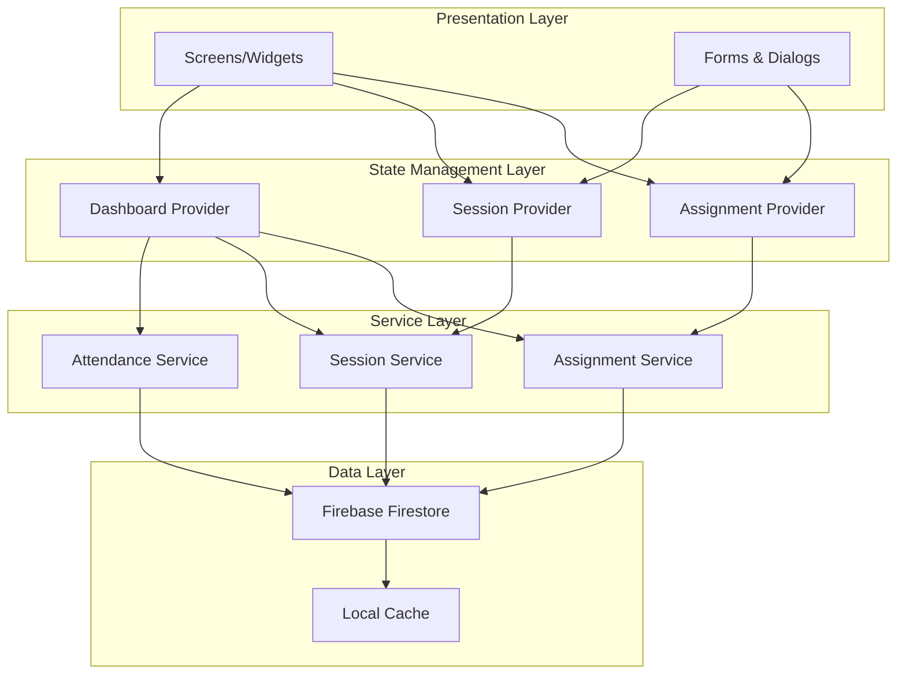

# Design Document: ALU Student Academic Platform

## Overview

The ALU Student Academic Platform is a Flutter mobile application that helps African Leadership University students manage their academic responsibilities through assignment tracking, session scheduling, attendance recording, and progress monitoring. The application uses Firebase Firestore for cloud-based data persistence, enabling real-time synchronization and offline support.

The design follows a clean architecture pattern with clear separation between UI (presentation), business logic (state management), and data layers (services). The application uses Flutter's Provider package for state management, offering a balance between simplicity and scalability suitable for the 48-hour development timeline.

### Key Design Principles

1. **Separation of Concerns**: Clear boundaries between UI widgets, state management, and data services
2. **Firebase-First**: All data operations go through Firestore with offline persistence enabled
3. **Reactive UI**: UI automatically updates when underlying data changes through Provider
4. **Mobile-Optimized**: Designed specifically for mobile devices with touch-friendly interactions
5. **Team Collaboration**: Architecture supports parallel development by 4 developers

## Architecture

### High-Level Architecture



### Layer Responsibilities

**Presentation Layer (UI)**
- Renders screens and widgets using Flutter Material Design
- Handles user input and gestures
- Displays data from providers
- No direct business logic or data access

**State Management Layer (Providers)**
- Manages application state using Provider package
- Notifies UI of state changes
- Coordinates between UI and services
- Handles loading states and error handling

**Service Layer**
- Encapsulates all Firebase Firestore operations
- Provides clean API for CRUD operations
- Handles data transformation between Firestore and models
- Manages offline persistence and sync

**Data Layer**
- Firebase Firestore collections and documents
- Local cache for offline support
- Real-time data synchronization

## Components and Interfaces

### Core Models

#### Assignment Model

```dart
class Assignment {
  final String id;
  final String title;
  final String course;
  final DateTime dueDate;
  final PriorityLevel priority;
  final bool isCompleted;
  final DateTime createdAt;
  final DateTime updatedAt;

  Assignment({
    required this.id,
    required this.title,
    required this.course,
    required this.dueDate,
    required this.priority,
    this.isCompleted = false,
    required this.createdAt,
    required this.updatedAt,
  });

  // Factory constructor from Firestore document
  factory Assignment.fromFirestore(DocumentSnapshot doc);
  
  // Convert to Firestore document
  Map<String, dynamic> toFirestore();
  
  // Copy with method for immutable updates
  Assignment copyWith({...});
  
  // Validation
  bool isValid();
  String? validateTitle();
  String? validateCourse();
  String? validateDueDate();
}

enum PriorityLevel {
  high,
  medium,
  low,
}
```

#### Session Model

```dart
class Session {
  final String id;
  final String title;
  final DateTime date;
  final TimeOfDay startTime;
  final TimeOfDay endTime;
  final String location;
  final SessionType type;
  final AttendanceStatus? attendanceStatus;
  final DateTime createdAt;
  final DateTime updatedAt;

  Session({
    required this.id,
    required this.title,
    required this.date,
    required this.startTime,
    required this.endTime,
    required this.location,
    required this.type,
    this.attendanceStatus,
    required this.createdAt,
    required this.updatedAt,
  });

  // Factory constructor from Firestore document
  factory Session.fromFirestore(DocumentSnapshot doc);
  
  // Convert to Firestore document
  Map<String, dynamic> toFirestore();
  
  // Copy with method for immutable updates
  Session copyWith({...});
  
  // Validation
  bool isValid();
  String? validateTitle();
  String? validateDate();
  String? validateTimeRange();
  String? validateLocation();
  
  // Helper methods
  bool isToday();
  bool isInWeek(DateTime weekStart);
  int getWeekNumber();
}

enum SessionType {
  classSession,
  masterySession,
  studyGroup,
  pslMeeting,
}

enum AttendanceStatus {
  present,
  absent,
}
```

#### Dashboard Summary Model

```dart
class DashboardSummary {
  final DateTime currentDate;
  final int academicWeek;
  final List<Session> todaySessions;
  final List<Assignment> upcomingAssignments;
  final double attendancePercentage;
  final int pendingAssignmentsCount;
  final bool isAttendanceBelowThreshold;

  DashboardSummary({
    required this.currentDate,
    required this.academicWeek,
    required this.todaySessions,
    required this.upcomingAssignments,
    required this.attendancePercentage,
    required this.pendingAssignmentsCount,
  }) : isAttendanceBelowThreshold = attendancePercentage < 75.0;
}
```

### Service Layer Interfaces

#### Assignment Service

```dart
class AssignmentService {
  final FirebaseFirestore _firestore;
  final String _collection = 'assignments';

  // Create
  Future<String> createAssignment(Assignment assignment);
  
  // Read
  Stream<List<Assignment>> getAssignmentsStream();
  Future<Assignment?> getAssignmentById(String id);
  Future<List<Assignment>> getUpcomingAssignments(int days);
  Future<int> getPendingAssignmentsCount();
  
  // Update
  Future<void> updateAssignment(Assignment assignment);
  Future<void> toggleAssignmentCompletion(String id);
  
  // Delete
  Future<void> deleteAssignment(String id);
  
  // Query helpers
  Future<List<Assignment>> getAssignmentsSortedByDueDate();
}
```

#### Session Service

```dart
class SessionService {
  final FirebaseFirestore _firestore;
  final String _collection = 'sessions';

  // Create
  Future<String> createSession(Session session);
  
  // Read
  Stream<List<Session>> getSessionsStream();
  Future<Session?> getSessionById(String id);
  Future<List<Session>> getSessionsForDate(DateTime date);
  Future<List<Session>> getSessionsForWeek(DateTime weekStart);
  
  // Update
  Future<void> updateSession(Session session);
  Future<void> recordAttendance(String id, AttendanceStatus status);
  
  // Delete
  Future<void> deleteSession(String id);
  
  // Query helpers
  Future<List<Session>> getTodaySessions();
}
```

#### Attendance Service

```dart
class AttendanceService {
  final FirebaseFirestore _firestore;

  // Calculate attendance percentage
  Future<double> calculateAttendancePercentage();
  
  // Get attendance statistics
  Future<Map<String, int>> getAttendanceStats();
  
  // Get sessions with recorded attendance
  Future<List<Session>> getSessionsWithAttendance();
  
  // Check if attendance is below threshold
  Future<bool> isAttendanceBelowThreshold();
}
```

### State Management (Providers)

#### Assignment Provider

```dart
class AssignmentProvider extends ChangeNotifier {
  final AssignmentService _service;
  List<Assignment> _assignments = [];
  bool _isLoading = false;
  String? _error;

  List<Assignment> get assignments => _assignments;
  bool get isLoading => _isLoading;
  String? get error => _error;

  // Initialize and listen to Firestore stream
  void initialize();
  
  // CRUD operations
  Future<void> createAssignment(Assignment assignment);
  Future<void> updateAssignment(Assignment assignment);
  Future<void> deleteAssignment(String id);
  Future<void> toggleCompletion(String id);
  
  // Queries
  List<Assignment> getUpcomingAssignments(int days);
  int getPendingCount();
}
```

#### Session Provider

```dart
class SessionProvider extends ChangeNotifier {
  final SessionService _service;
  List<Session> _sessions = [];
  bool _isLoading = false;
  String? _error;

  List<Session> get sessions => _sessions;
  bool get isLoading => _isLoading;
  String? get error => _error;

  // Initialize and listen to Firestore stream
  void initialize();
  
  // CRUD operations
  Future<void> createSession(Session session);
  Future<void> updateSession(Session session);
  Future<void> deleteSession(String id);
  Future<void> recordAttendance(String id, AttendanceStatus status);
  
  // Queries
  List<Session> getTodaySessions();
  List<Session> getSessionsForWeek(DateTime weekStart);
}
```

#### Dashboard Provider

```dart
class DashboardProvider extends ChangeNotifier {
  final AssignmentService _assignmentService;
  final SessionService _sessionService;
  final AttendanceService _attendanceService;
  
  DashboardSummary? _summary;
  bool _isLoading = false;
  String? _error;

  DashboardSummary? get summary => _summary;
  bool get isLoading => _isLoading;
  String? get error => _error;

  // Load dashboard data
  Future<void> loadDashboard();
  
  // Refresh dashboard
  Future<void> refresh();
  
  // Calculate academic week
  int calculateAcademicWeek(DateTime date);
}
```

### Screen Components

#### Main Navigation Structure

```dart
class MainApp extends StatelessWidget {
  Widget build(BuildContext context) {
    return MultiProvider(
      providers: [
        ChangeNotifierProvider(create: (_) => AssignmentProvider(...)),
        ChangeNotifierProvider(create: (_) => SessionProvider(...)),
        ChangeNotifierProvider(create: (_) => DashboardProvider(...)),
      ],
      child: MaterialApp(
        home: MainNavigationScreen(),
      ),
    );
  }
}

class MainNavigationScreen extends StatefulWidget {
  // Bottom navigation with 3 tabs
  // - Dashboard (index 0)
  // - Assignments (index 1)
  // - Schedule (index 2)
}
```

#### Screen Hierarchy

1. **DashboardScreen**
   - CurrentDateWidget
   - AcademicWeekWidget
   - TodaySessionsCard
   - UpcomingAssignmentsCard
   - AttendanceStatusCard

2. **AssignmentsScreen**
   - AssignmentListView
     - AssignmentCard (for each assignment)
   - FloatingActionButton (add assignment)
   - AssignmentFormDialog

3. **ScheduleScreen**
   - WeekNavigationBar
   - SessionListView (grouped by day)
     - SessionCard (for each session)
   - FloatingActionButton (add session)
   - SessionFormDialog
   - AttendanceDialog

### Widget Components

#### Reusable Widgets

```dart
// Assignment Card Widget
class AssignmentCard extends StatelessWidget {
  final Assignment assignment;
  final VoidCallback onToggleComplete;
  final VoidCallback onEdit;
  final VoidCallback onDelete;
}

// Session Card Widget
class SessionCard extends StatelessWidget {
  final Session session;
  final VoidCallback? onRecordAttendance;
  final VoidCallback onEdit;
  final VoidCallback onDelete;
}

// Attendance Status Widget
class AttendanceStatusWidget extends StatelessWidget {
  final double percentage;
  final bool showWarning;
}

// Priority Badge Widget
class PriorityBadge extends StatelessWidget {
  final PriorityLevel priority;
}

// Session Type Badge Widget
class SessionTypeBadge extends StatelessWidget {
  final SessionType type;
}

// Form Field Widgets
class DatePickerField extends StatelessWidget {
  final DateTime? initialDate;
  final Function(DateTime) onDateSelected;
  final String? errorText;
}

class TimePickerField extends StatelessWidget {
  final TimeOfDay? initialTime;
  final Function(TimeOfDay) onTimeSelected;
  final String? errorText;
}
```

## Data Models

### Firestore Schema

#### Collections Structure

```
firestore
├── assignments (collection)
│   └── {assignmentId} (document)
│       ├── id: string
│       ├── title: string
│       ├── course: string
│       ├── dueDate: timestamp
│       ├── priority: string ("high" | "medium" | "low")
│       ├── isCompleted: boolean
│       ├── createdAt: timestamp
│       └── updatedAt: timestamp
│
└── sessions (collection)
    └── {sessionId} (document)
        ├── id: string
        ├── title: string
        ├── date: timestamp
        ├── startTime: string (HH:mm format)
        ├── endTime: string (HH:mm format)
        ├── location: string
        ├── type: string ("class" | "mastery" | "study_group" | "psl")
        ├── attendanceStatus: string? ("present" | "absent" | null)
        ├── createdAt: timestamp
        └── updatedAt: timestamp
```

#### Firestore Indexes

Required composite indexes for efficient queries:

1. **Assignments by due date**
   - Collection: `assignments`
   - Fields: `isCompleted` (Ascending), `dueDate` (Ascending)

2. **Sessions by date**
   - Collection: `sessions`
   - Fields: `date` (Ascending), `startTime` (Ascending)

3. **Sessions with attendance**
   - Collection: `sessions`
   - Fields: `attendanceStatus` (Ascending), `date` (Descending)

### Data Transformation

#### TimeOfDay Storage

Since Firestore doesn't have a native TimeOfDay type, times are stored as strings in HH:mm format:

```dart
// Convert TimeOfDay to string
String timeToString(TimeOfDay time) {
  return '${time.hour.toString().padLeft(2, '0')}:${time.minute.toString().padLeft(2, '0')}';
}

// Convert string to TimeOfDay
TimeOfDay stringToTime(String timeString) {
  final parts = timeString.split(':');
  return TimeOfDay(hour: int.parse(parts[0]), minute: int.parse(parts[1]));
}
```

#### Enum Storage

Enums are stored as strings in Firestore:

```dart
// Priority Level
String priorityToString(PriorityLevel priority) => priority.name;
PriorityLevel stringToPriority(String str) => PriorityLevel.values.byName(str);

// Session Type
String sessionTypeToString(SessionType type) {
  switch (type) {
    case SessionType.classSession: return 'class';
    case SessionType.masterySession: return 'mastery';
    case SessionType.studyGroup: return 'study_group';
    case SessionType.pslMeeting: return 'psl';
  }
}

// Attendance Status
String? attendanceToString(AttendanceStatus? status) => status?.name;
AttendanceStatus? stringToAttendance(String? str) => 
  str != null ? AttendanceStatus.values.byName(str) : null;
```

### Validation Rules

#### Assignment Validation

```dart
class AssignmentValidator {
  static String? validateTitle(String? title) {
    if (title == null || title.trim().isEmpty) {
      return 'Title is required';
    }
    if (title.length > 100) {
      return 'Title must be 100 characters or less';
    }
    return null;
  }

  static String? validateCourse(String? course) {
    if (course == null || course.trim().isEmpty) {
      return 'Course is required';
    }
    if (course.length > 50) {
      return 'Course must be 50 characters or less';
    }
    return null;
  }

  static String? validateDueDate(DateTime? dueDate) {
    if (dueDate == null) {
      return 'Due date is required';
    }
    return null;
  }
}
```

#### Session Validation

```dart
class SessionValidator {
  static String? validateTitle(String? title) {
    if (title == null || title.trim().isEmpty) {
      return 'Title is required';
    }
    if (title.length > 100) {
      return 'Title must be 100 characters or less';
    }
    return null;
  }

  static String? validateDate(DateTime? date) {
    if (date == null) {
      return 'Date is required';
    }
    return null;
  }

  static String? validateTimeRange(TimeOfDay? startTime, TimeOfDay? endTime) {
    if (startTime == null) {
      return 'Start time is required';
    }
    if (endTime == null) {
      return 'End time is required';
    }
    
    // Convert to minutes for comparison
    final startMinutes = startTime.hour * 60 + startTime.minute;
    final endMinutes = endTime.hour * 60 + endTime.minute;
    
    if (endMinutes <= startMinutes) {
      return 'End time must be after start time';
    }
    
    return null;
  }

  static String? validateLocation(String? location) {
    if (location == null || location.trim().isEmpty) {
      return 'Location is required';
    }
    if (location.length > 100) {
      return 'Location must be 100 characters or less';
    }
    return null;
  }
}
```

## Firebase Integration

### Initialization

```dart
void main() async {
  WidgetsFlutterBinding.ensureInitialized();
  
  try {
    await Firebase.initializeApp(
      options: DefaultFirebaseOptions.currentPlatform,
    );
    
    // Enable offline persistence
    FirebaseFirestore.instance.settings = const Settings(
      persistenceEnabled: true,
      cacheSizeBytes: Settings.CACHE_SIZE_UNLIMITED,
    );
    
    runApp(const MainApp());
  } catch (e) {
    // Handle initialization error
    runApp(ErrorApp(error: e.toString()));
  }
}
```

### Offline Persistence Strategy

1. **Enable Firestore Offline Persistence**: All data is cached locally automatically
2. **Optimistic Updates**: UI updates immediately, syncs to Firestore in background
3. **Conflict Resolution**: Last-write-wins (Firestore default)
4. **Error Handling**: Display user-friendly messages when operations fail

### Real-time Synchronization

All data access uses Firestore streams for real-time updates:

```dart
Stream<List<Assignment>> getAssignmentsStream() {
  return _firestore
      .collection(_collection)
      .orderBy('dueDate', descending: false)
      .snapshots()
      .map((snapshot) => snapshot.docs
          .map((doc) => Assignment.fromFirestore(doc))
          .toList());
}
```

### Error Handling

```dart
class FirestoreErrorHandler {
  static String getErrorMessage(dynamic error) {
    if (error is FirebaseException) {
      switch (error.code) {
        case 'permission-denied':
          return 'You do not have permission to perform this action';
        case 'unavailable':
          return 'Service temporarily unavailable. Please try again.';
        case 'not-found':
          return 'The requested data was not found';
        default:
          return 'An error occurred: ${error.message}';
      }
    }
    return 'An unexpected error occurred';
  }
}
```

## Navigation Flow

### Bottom Navigation Implementation

```dart
class MainNavigationScreen extends StatefulWidget {
  @override
  State<MainNavigationScreen> createState() => _MainNavigationScreenState();
}

class _MainNavigationScreenState extends State<MainNavigationScreen> {
  int _currentIndex = 0;
  
  final List<Widget> _screens = [
    DashboardScreen(),
    AssignmentsScreen(),
    ScheduleScreen(),
  ];

  @override
  Widget build(BuildContext context) {
    return Scaffold(
      body: IndexedStack(
        index: _currentIndex,
        children: _screens,
      ),
      bottomNavigationBar: BottomNavigationBar(
        currentIndex: _currentIndex,
        onTap: (index) => setState(() => _currentIndex = index),
        items: const [
          BottomNavigationBarItem(
            icon: Icon(Icons.dashboard),
            label: 'Dashboard',
          ),
          BottomNavigationBarItem(
            icon: Icon(Icons.assignment),
            label: 'Assignments',
          ),
          BottomNavigationBarItem(
            icon: Icon(Icons.calendar_today),
            label: 'Schedule',
          ),
        ],
      ),
    );
  }
}
```

### State Preservation

Using `IndexedStack` ensures that:
- All three screens remain in memory
- Screen state is preserved when switching tabs
- No data loss when navigating between screens
- Smooth transitions without rebuilding

## UI/UX Design

### Theme Configuration

```dart
ThemeData buildALUTheme() {
  return ThemeData(
    primaryColor: const Color(0xFF003DA5), // ALU Blue
    colorScheme: ColorScheme.fromSeed(
      seedColor: const Color(0xFF003DA5),
      secondary: const Color(0xFFFF6B35), // ALU Orange
    ),
    scaffoldBackgroundColor: const Color(0xFFF5F5F5),
    appBarTheme: const AppBarTheme(
      backgroundColor: Color(0xFF003DA5),
      foregroundColor: Colors.white,
      elevation: 2,
    ),
    bottomNavigationBarTheme: const BottomNavigationBarTheme(
      selectedItemColor: Color(0xFF003DA5),
      unselectedItemColor: Color(0xFF757575),
      backgroundColor: Colors.white,
    ),
    floatingActionButtonTheme: const FloatingActionButtonThemeData(
      backgroundColor: Color(0xFFFF6B35),
    ),
    cardTheme: CardTheme(
      elevation: 2,
      shape: RoundedRectangleBorder(
        borderRadius: BorderRadius.circular(12),
      ),
    ),
  );
}
```

### Color Constants

```dart
class ALUColors {
  static const primary = Color(0xFF003DA5);
  static const secondary = Color(0xFFFF6B35);
  static const success = Color(0xFF4CAF50);
  static const warning = Color(0xFFFF9800);
  static const error = Color(0xFFF44336);
  static const textPrimary = Color(0xFF212121);
  static const textSecondary = Color(0xFF757575);
  static const background = Color(0xFFF5F5F5);
  
  // Priority colors
  static const priorityHigh = Color(0xFFF44336);
  static const priorityMedium = Color(0xFFFF9800);
  static const priorityLow = Color(0xFF4CAF50);
}
```

### Responsive Design

```dart
class ResponsiveHelper {
  static double getScreenWidth(BuildContext context) {
    return MediaQuery.of(context).size.width;
  }
  
  static double getScreenHeight(BuildContext context) {
    return MediaQuery.of(context).size.height;
  }
  
  static EdgeInsets getScreenPadding(BuildContext context) {
    return const EdgeInsets.all(16.0);
  }
  
  static double getCardSpacing() => 12.0;
  
  static double getMinTouchTarget() => 48.0;
}
```

### Accessibility

- Minimum touch target size: 48x48 dp
- Sufficient color contrast ratios (WCAG AA)
- Semantic labels for screen readers
- Keyboard navigation support
- Clear error messages and validation feedback


## Correctness Properties

A property is a characteristic or behavior that should hold true across all valid executions of a system—essentially, a formal statement about what the system should do. Properties serve as the bridge between human-readable specifications and machine-verifiable correctness guarantees.

### Property Reflection

After analyzing all acceptance criteria, several redundancies were identified:
- Properties 4.3 and 4.4 duplicate properties 1.5 and 1.6 (attendance display)
- Property 6.3 is covered by 6.2 (session persistence includes attendance)
- Property 9.5 duplicates 7.2 (responsive design)

These redundant properties have been consolidated to avoid duplicate testing.

### Data Management Properties

**Property 1: Assignment Creation Increases List Size**
*For any* valid assignment data (non-empty title, course, valid due date, and priority level), creating an assignment should result in the assignment list growing by exactly one and containing an assignment with the provided data.
**Validates: Requirements 2.1**

**Property 2: Session Creation Increases List Size**
*For any* valid session data (non-empty title, valid date, valid time range where end > start, non-empty location, and valid session type), creating a session should result in the session list growing by exactly one and containing a session with the provided data.
**Validates: Requirements 3.1**

**Property 3: Assignment Deletion Decreases List Size**
*For any* assignment in the assignment list, deleting it should result in the list length decreasing by exactly one and the list no longer containing that assignment.
**Validates: Requirements 2.5**

**Property 4: Session Deletion Decreases List Size**
*For any* session in the session list, deleting it should result in the list length decreasing by exactly one and the list no longer containing that session.
**Validates: Requirements 3.5**

**Property 5: Assignment Update Preserves Identity**
*For any* assignment and valid new data, updating the assignment should change the specified fields while preserving the assignment's ID and maintaining all validation rules.
**Validates: Requirements 2.6**

**Property 6: Session Update Preserves Identity**
*For any* session and valid new data, updating the session should change the specified fields while preserving the session's ID and maintaining all validation rules.
**Validates: Requirements 3.6**

**Property 7: Assignment Completion Toggle**
*For any* assignment, marking it as completed should change its isCompleted status from false to true, and the assignment should remain in the list with all other fields unchanged.
**Validates: Requirements 2.4**

**Property 8: Attendance Recording Updates Session**
*For any* session and attendance status (Present or Absent), recording attendance should update that session's attendanceStatus field to the provided value while preserving all other session fields.
**Validates: Requirements 4.1**

### Validation Properties

**Property 9: Invalid Assignment Data Rejected**
*For any* assignment data with missing required fields (empty title, empty course, null due date, or null priority), attempting to create the assignment should fail with a validation error message and the assignment list should remain unchanged.
**Validates: Requirements 2.2**

**Property 10: Invalid Session Data Rejected**
*For any* session data with invalid date/time (null date, null start time, null end time, or end time before or equal to start time), attempting to create the session should fail with a validation error message and the session list should remain unchanged.
**Validates: Requirements 3.2**

**Property 11: Time Range Validation**
*For any* pair of start time and end time where the end time is before or equal to the start time, the validation function should return an error message indicating that end time must be after start time.
**Validates: Requirements 8.3**

**Property 12: Date Validation**
*For any* date input, the validation function should accept valid DateTime objects and reject null values with an appropriate error message.
**Validates: Requirements 8.1**

**Property 13: Time Validation**
*For any* time input, the validation function should accept valid TimeOfDay objects and reject null values with an appropriate error message.
**Validates: Requirements 8.2**

**Property 14: Validation Error Messages**
*For any* validation failure (missing required field, invalid format, or invalid range), the validator should return a non-null, non-empty error message describing the specific issue.
**Validates: Requirements 8.4**

**Property 15: Valid Data Enables Actions**
*For any* form with all required fields containing valid data, the form's isValid() method should return true, enabling the save/create action.
**Validates: Requirements 8.5**

**Property 16: Session Type Constraint**
*For any* session, the session type must be exactly one of: Class, Mastery Session, Study Group, or PSL Meeting (enforced by SessionType enum).
**Validates: Requirements 3.4**

### Query and Filtering Properties

**Property 17: Assignment Sorting by Due Date**
*For any* list of assignments, when sorted by due date, each assignment's due date should be less than or equal to the next assignment's due date (ascending order).
**Validates: Requirements 2.3**

**Property 18: Today's Sessions Filter**
*For any* set of sessions and a given date, filtering for today's sessions should return only sessions where the session date equals the given date, and should include all such sessions.
**Validates: Requirements 1.3**

**Property 19: Upcoming Assignments Filter**
*For any* set of assignments and a current date, filtering for upcoming assignments (next 7 days) should return only assignments where the due date is between the current date (inclusive) and current date + 7 days (inclusive), and should include all such assignments.
**Validates: Requirements 1.4**

**Property 20: Weekly Sessions Filter**
*For any* set of sessions and a given week start date, filtering for sessions in that week should return only sessions where the session date is between the week start (inclusive) and week start + 7 days (exclusive), and should include all such sessions.
**Validates: Requirements 3.3**

**Property 21: Attendance History Filter**
*For any* set of sessions, filtering for sessions with recorded attendance should return only sessions where attendanceStatus is not null (either Present or Absent), and should include all such sessions.
**Validates: Requirements 4.5**

### Calculation Properties

**Property 22: Attendance Percentage Calculation**
*For any* set of sessions with recorded attendance, the attendance percentage should equal (count of sessions with Present status / count of sessions with any attendance status) × 100, rounded to two decimal places.
**Validates: Requirements 1.5, 4.2**

**Property 23: Pending Assignments Count**
*For any* set of assignments, the pending assignments count should equal the number of assignments where isCompleted is false.
**Validates: Requirements 1.7**

**Property 24: Academic Week Calculation**
*For any* date, the academic week number should be calculated consistently based on a defined semester start date, where week 1 begins on the semester start date and each subsequent week begins 7 days later.
**Validates: Requirements 1.2**

**Property 25: Attendance Warning Threshold**
*For any* attendance percentage value, if the percentage is less than 75.0, the isAttendanceBelowThreshold flag should be true; otherwise it should be false.
**Validates: Requirements 1.6**

### Firebase Persistence Properties

**Property 26: Assignment Firestore Round-Trip**
*For any* valid assignment, creating it in Firestore and then reading it back should produce an assignment with equivalent data (same title, course, due date, priority, and completion status).
**Validates: Requirements 6.1**

**Property 27: Session Firestore Round-Trip**
*For any* valid session, creating it in Firestore and then reading it back should produce a session with equivalent data (same title, date, times, location, type, and attendance status).
**Validates: Requirements 6.2**

**Property 28: Firestore Data Loading on Startup**
*For any* data persisted in Firestore (assignments and sessions), starting the application should load all that data into the application state, making it available to the UI.
**Validates: Requirements 6.4**

**Property 29: Offline Data Synchronization**
*For any* data change made while offline (create, update, or delete), when connectivity is restored, the change should be synchronized to Firestore and reflected in the cloud database.
**Validates: Requirements 6.6**

**Property 30: Firestore Error Handling**
*For any* Firestore operation that fails with an error, the error should be caught and transformed into a user-friendly error message that is displayed to the user without crashing the application.
**Validates: Requirements 6.7**

### Navigation and State Properties

**Property 31: Tab Navigation**
*For any* tab index (0, 1, or 2), tapping that tab in the navigation bar should display the corresponding screen (Dashboard for 0, Assignments for 1, Schedule for 2).
**Validates: Requirements 5.2**

**Property 32: State Preservation Across Navigation**
*For any* screen with user-entered data or scroll position, navigating to a different screen and then back should preserve that data and scroll position without loss.
**Validates: Requirements 5.3**

### UI Rendering Properties

**Property 33: No Pixel Overflow**
*For any* standard mobile screen size (width between 320dp and 768dp, height between 568dp and 1024dp), rendering any screen should not produce pixel overflow errors.
**Validates: Requirements 7.2**

## Error Handling

### Error Categories

1. **Validation Errors**: User input that doesn't meet requirements
2. **Network Errors**: Firestore connection or sync failures
3. **Initialization Errors**: Firebase setup failures
4. **Data Errors**: Corrupted or missing data in Firestore

### Error Handling Strategy

#### Validation Errors

```dart
class ValidationError {
  final String field;
  final String message;
  
  ValidationError(this.field, this.message);
}

// Display inline with form fields
// Example: "Title is required"
// Example: "End time must be after start time"
```

#### Network Errors

```dart
void handleNetworkError(dynamic error) {
  String message;
  
  if (error is FirebaseException) {
    switch (error.code) {
      case 'unavailable':
        message = 'Unable to connect. Your changes will sync when online.';
        break;
      case 'permission-denied':
        message = 'You don\'t have permission to perform this action.';
        break;
      default:
        message = 'A network error occurred. Please try again.';
    }
  } else {
    message = 'An unexpected error occurred.';
  }
  
  // Show SnackBar with message
  ScaffoldMessenger.of(context).showSnackBar(
    SnackBar(content: Text(message)),
  );
}
```

#### Initialization Errors

```dart
class ErrorApp extends StatelessWidget {
  final String error;
  
  const ErrorApp({required this.error});
  
  @override
  Widget build(BuildContext context) {
    return MaterialApp(
      home: Scaffold(
        body: Center(
          child: Column(
            mainAxisAlignment: MainAxisAlignment.center,
            children: [
              Icon(Icons.error_outline, size: 64, color: Colors.red),
              SizedBox(height: 16),
              Text('Failed to initialize app'),
              SizedBox(height: 8),
              Text(error, style: TextStyle(fontSize: 12)),
              SizedBox(height: 16),
              ElevatedButton(
                onPressed: () => exit(0),
                child: Text('Close App'),
              ),
            ],
          ),
        ),
      ),
    );
  }
}
```

#### Data Errors

```dart
// Graceful degradation for missing or corrupted data
Assignment? safeParseAssignment(DocumentSnapshot doc) {
  try {
    return Assignment.fromFirestore(doc);
  } catch (e) {
    // Log error for debugging
    debugPrint('Failed to parse assignment ${doc.id}: $e');
    // Skip this document and continue
    return null;
  }
}

// Filter out null values
List<Assignment> assignments = snapshot.docs
    .map((doc) => safeParseAssignment(doc))
    .whereType<Assignment>()
    .toList();
```

### User Feedback

#### Loading States

```dart
// Show loading indicator during async operations
if (isLoading) {
  return Center(child: CircularProgressIndicator());
}
```

#### Success Feedback

```dart
// Show success message after operations
ScaffoldMessenger.of(context).showSnackBar(
  SnackBar(
    content: Text('Assignment created successfully'),
    backgroundColor: Colors.green,
    duration: Duration(seconds: 2),
  ),
);
```

#### Error Feedback

```dart
// Show error message with retry option
ScaffoldMessenger.of(context).showSnackBar(
  SnackBar(
    content: Text('Failed to save. Tap to retry.'),
    backgroundColor: Colors.red,
    action: SnackBarAction(
      label: 'Retry',
      onPressed: () => retryOperation(),
    ),
    duration: Duration(seconds: 5),
  ),
);
```

## Testing Strategy

### Dual Testing Approach

The application will use both unit tests and property-based tests to ensure comprehensive coverage:

- **Unit tests**: Verify specific examples, edge cases, and error conditions
- **Property tests**: Verify universal properties across all inputs

Both testing approaches are complementary and necessary for comprehensive coverage. Unit tests catch concrete bugs in specific scenarios, while property tests verify general correctness across a wide range of inputs.

### Property-Based Testing

**Library**: We will use the `test` package with custom property test helpers, or integrate a property-based testing library like `dart_check` if available.

**Configuration**:
- Minimum 100 iterations per property test (due to randomization)
- Each property test must reference its design document property
- Tag format: `// Feature: alu-academic-platform, Property {number}: {property_text}`

**Example Property Test Structure**:

```dart
// Feature: alu-academic-platform, Property 1: Assignment Creation Increases List Size
test('Property 1: Creating valid assignment increases list size', () {
  for (int i = 0; i < 100; i++) {
    // Generate random valid assignment data
    final assignment = generateRandomAssignment();
    final initialList = [...currentAssignments];
    final initialLength = initialList.length;
    
    // Create assignment
    final newList = [...initialList, assignment];
    
    // Verify property
    expect(newList.length, equals(initialLength + 1));
    expect(newList, contains(assignment));
  }
});
```

### Unit Testing

**Focus Areas**:
- Specific examples demonstrating correct behavior
- Edge cases (empty lists, boundary dates, etc.)
- Error conditions (null values, invalid formats)
- Integration between components

**Example Unit Test Structure**:

```dart
test('Assignment with empty title fails validation', () {
  final assignment = Assignment(
    id: '1',
    title: '',
    course: 'Math',
    dueDate: DateTime.now(),
    priority: PriorityLevel.high,
  );
  
  expect(assignment.validateTitle(), isNotNull);
  expect(assignment.isValid(), isFalse);
});
```

### Test Coverage Goals

- **Models**: 100% coverage of validation logic
- **Services**: 90%+ coverage of CRUD operations
- **Providers**: 85%+ coverage of state management logic
- **Widgets**: 70%+ coverage of critical UI components

### Testing Priorities

1. **High Priority** (Must test):
   - Data validation (Properties 9-16)
   - Firestore persistence (Properties 26-30)
   - Calculation logic (Properties 22-25)
   - CRUD operations (Properties 1-8)

2. **Medium Priority** (Should test):
   - Query and filtering (Properties 17-21)
   - Navigation (Properties 31-32)
   - Error handling

3. **Low Priority** (Nice to test):
   - UI rendering (Property 33)
   - Visual design elements

### Integration Testing

**Scenarios to Test**:
1. Complete assignment workflow: Create → View → Edit → Complete → Delete
2. Complete session workflow: Create → View → Edit → Record Attendance → Delete
3. Dashboard data aggregation: Verify all dashboard cards show correct data
4. Offline-to-online sync: Make changes offline, verify sync when online
5. Navigation flow: Navigate between all screens, verify state preservation

### Widget Testing

**Key Widgets to Test**:
- AssignmentCard: Verify display and interaction
- SessionCard: Verify display and interaction
- AttendanceStatusWidget: Verify warning display logic
- Form dialogs: Verify validation and submission
- Dashboard cards: Verify data display

### Mock Strategy

**Mocked Dependencies**:
- Firebase Firestore: Use fake Firestore or in-memory implementation
- DateTime.now(): Mock for consistent test results
- Network connectivity: Mock for offline testing

**Example Mock**:

```dart
class MockAssignmentService implements AssignmentService {
  final List<Assignment> _assignments = [];
  
  @override
  Future<String> createAssignment(Assignment assignment) async {
    _assignments.add(assignment);
    return assignment.id;
  }
  
  @override
  Stream<List<Assignment>> getAssignmentsStream() {
    return Stream.value(_assignments);
  }
  
  // ... other methods
}
```

## Development Workflow

### Team Structure (4 Developers, 48 Hours)

**Developer 1: Firebase & Assignment Features**
- Firebase setup and configuration
- Assignment model and service
- Assignment provider
- Assignment screen and forms

**Developer 2: Session & Attendance Features**
- Session model and service
- Attendance service
- Session provider
- Schedule screen and forms
- Attendance recording

**Developer 3: Dashboard & UI/UX**
- Dashboard provider and screen
- Dashboard summary calculations
- UI theme and styling
- Reusable widget components
- Visual polish

**Developer 4: Navigation & Integration**
- Main app structure
- Bottom navigation
- State management setup
- Integration testing
- Bug fixes and polish

### Day 1 (24 Hours): Foundation & Core Features

**Hours 0-4: Setup**
- Project initialization
- Firebase configuration
- Dependencies installation
- Git repository setup
- Team coordination

**Hours 4-12: Core Implementation**
- Models and validation
- Services layer
- Providers setup
- Basic UI screens

**Hours 12-24: Feature Development**
- Assignment CRUD
- Session CRUD
- Dashboard implementation
- Navigation setup

### Day 2 (24 Hours): Integration & Polish

**Hours 24-32: Integration**
- Connect all components
- Firestore integration
- Real-time updates
- Error handling

**Hours 32-40: Testing & Polish**
- Unit tests
- Property tests
- Integration tests
- UI/UX refinement
- Bug fixes

**Hours 40-48: Deliverables**
- Final testing
- Video recording
- Documentation
- Submission preparation

### Git Workflow

**Branch Strategy**:
- `main`: Production-ready code
- `dev`: Integration branch
- `feature/assignments`: Developer 1
- `feature/sessions`: Developer 2
- `feature/dashboard`: Developer 3
- `feature/navigation`: Developer 4

**Commit Conventions**:
- `feat:` New feature
- `fix:` Bug fix
- `test:` Add tests
- `refactor:` Code refactoring
- `docs:` Documentation
- `style:` Formatting

**Merge Strategy**:
- Feature branches → `dev` (frequent merges)
- `dev` → `main` (after testing)
- Code review required for main merges

### Communication

**Daily Standups** (15 minutes):
- What did you complete?
- What are you working on?
- Any blockers?

**Integration Points** (Every 8 hours):
- Merge to dev branch
- Integration testing
- Resolve conflicts

**Tools**:
- Slack/Discord: Real-time communication
- GitHub: Code collaboration
- Figma/UI Mockup: Design reference
- Firebase Console: Database monitoring

## Deliverables

### Code Deliverables

1. **Flutter Application**
   - Complete source code
   - All features implemented
   - Tests passing
   - No critical bugs

2. **Firebase Configuration**
   - Firestore database setup
   - Security rules configured
   - Indexes created
   - Configuration files included

3. **Documentation**
   - README with setup instructions
   - API documentation
   - Architecture overview
   - Known issues/limitations

### Video Deliverable

**Content** (3-5 minutes):
1. App demonstration (2-3 minutes)
   - Dashboard overview
   - Create assignment
   - Create session
   - Record attendance
   - Navigation flow

2. Technical highlights (1-2 minutes)
   - Firebase integration
   - State management
   - Offline support
   - Code quality

**Format**:
- Screen recording with voiceover
- Clear audio and video quality
- Smooth transitions
- Professional presentation

### Submission Package

```
submission/
├── source_code/
│   ├── lib/
│   ├── test/
│   ├── pubspec.yaml
│   └── README.md
├── firebase_config/
│   ├── firestore.rules
│   ├── firestore.indexes.json
│   └── setup_instructions.md
├── documentation/
│   ├── architecture.md
│   ├── api_documentation.md
│   └── user_guide.md
├── video/
│   └── demo_video.mp4
└── README.md
```

## Conclusion

This design provides a comprehensive blueprint for building the ALU Student Academic Platform within the 48-hour timeline. The architecture emphasizes:

1. **Clear separation of concerns** for parallel development
2. **Firebase-first approach** for reliable data persistence
3. **Property-based testing** for correctness guarantees
4. **Mobile-optimized UX** following Material Design
5. **Team collaboration** with defined roles and workflows

The design addresses all requirements from the requirements document and provides detailed specifications for models, services, providers, and UI components. The testing strategy ensures both specific examples and universal properties are validated, giving confidence in the application's correctness.
