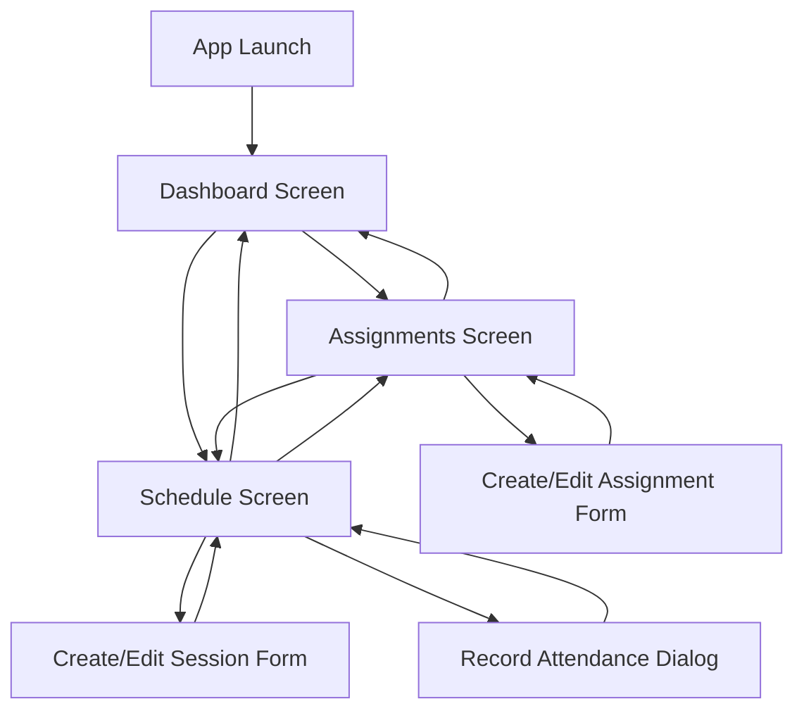

# UI Mockup: ALU Student Academic Platform

## Navigation Structure



## Screen Layouts

### 1. Dashboard Screen (Home)

```
┌─────────────────────────────────────┐
│  ALU Academic Platform       ☰      │ <- AppBar (ALU Colors)
├─────────────────────────────────────┤
│                                     │
│  📅 Monday, January 15, 2024        │
│  📚 Academic Week 3                 │
│                                     │
│  ┌───────────────────────────────┐ │
│  │ Today's Sessions              │ │
│  ├───────────────────────────────┤ │
│  │ 🕐 9:00 AM - Data Structures  │ │
│  │    Room: A101                 │ │
│  │                               │ │
│  │ 🕑 2:00 PM - Study Group      │ │
│  │    Room: Library              │ │
│  └───────────────────────────────┘ │
│                                     │
│  ┌───────────────────────────────┐ │
│  │ Upcoming Assignments (7 days) │ │
│  ├───────────────────────────────┤ │
│  │ 📝 3 assignments due          │ │
│  │                               │ │
│  │ • Math Assignment - Jan 17    │ │
│  │ • CS Project - Jan 19         │ │
│  │ • Essay Draft - Jan 20        │ │
│  └───────────────────────────────┘ │
│                                     │
│  ┌───────────────────────────────┐ │
│  │ Attendance Status             │ │
│  ├───────────────────────────────┤ │
│  │ 📊 82% ✓                      │ │ <- Green if >= 75%
│  │                               │ │
│  │ [Or if < 75%:]                │ │
│  │ ⚠️  68% - Below Threshold!    │ │ <- Red warning
│  └───────────────────────────────┘ │
│                                     │
├─────────────────────────────────────┤
│  🏠 Dashboard  📝 Assignments  📅   │ <- Bottom Nav Bar
│                              Schedule│
└─────────────────────────────────────┘
```

### 2. Assignments Screen

```
┌─────────────────────────────────────┐
│  Assignments                 +       │ <- AppBar with Add button
├─────────────────────────────────────┤
│                                     │
│  ┌───────────────────────────────┐ │
│  │ 📝 Math Assignment            │ │
│  │ Course: Calculus II           │ │
│  │ Due: Jan 17, 2024             │ │
│  │ Priority: High 🔴            │ │
│  │ [ ] Mark Complete  ✏️  🗑️    │ │
│  └───────────────────────────────┘ │
│                                     │
│  ┌───────────────────────────────┐ │
│  │ 📝 CS Project                 │ │
│  │ Course: Data Structures       │ │
│  │ Due: Jan 19, 2024             │ │
│  │ Priority: Medium 🟡          │ │
│  │ [ ] Mark Complete  ✏️  🗑️    │ │
│  └───────────────────────────────┘ │
│                                     │
│  ┌───────────────────────────────┐ │
│  │ ✓ Essay Draft (Completed)     │ │
│  │ Course: English               │ │
│  │ Due: Jan 20, 2024             │ │
│  │ Priority: Low 🟢             │ │
│  │ [✓] Completed  ✏️  🗑️        │ │
│  └───────────────────────────────┘ │
│                                     │
├─────────────────────────────────────┤
│  🏠          📝 Assignments  📅      │
│                              Schedule│
└─────────────────────────────────────┘
```

### 3. Create/Edit Assignment Form

```
┌─────────────────────────────────────┐
│  ← New Assignment                   │
├─────────────────────────────────────┤
│                                     │
│  Title *                            │
│  ┌───────────────────────────────┐ │
│  │ Math Assignment               │ │
│  └───────────────────────────────┘ │
│                                     │
│  Course *                           │
│  ┌───────────────────────────────┐ │
│  │ Calculus II                   │ │
│  └───────────────────────────────┘ │
│                                     │
│  Due Date *                         │
│  ┌───────────────────────────────┐ │
│  │ 01/17/2024          📅        │ │
│  └───────────────────────────────┘ │
│                                     │
│  Priority Level *                   │
│  ┌───────────────────────────────┐ │
│  │ High ▼                        │ │
│  └───────────────────────────────┘ │
│                                     │
│                                     │
│  ┌─────────────┐  ┌─────────────┐ │
│  │   Cancel    │  │    Save     │ │
│  └─────────────┘  └─────────────┘ │
│                                     │
└─────────────────────────────────────┘
```

### 4. Schedule Screen

```
┌─────────────────────────────────────┐
│  Schedule                    +       │ <- AppBar with Add button
├─────────────────────────────────────┤
│                                     │
│  Week of Jan 15 - Jan 21, 2024      │
│  ◀ Previous Week    Next Week ▶     │
│                                     │
│  ┌───────────────────────────────┐ │
│  │ Monday, Jan 15                │ │
│  ├───────────────────────────────┤ │
│  │ 🕐 9:00 AM - 10:30 AM         │ │
│  │ Data Structures (Class)       │ │
│  │ 📍 Room A101                  │ │
│  │ ✓ Present  ✏️  🗑️            │ │
│  │                               │ │
│  │ 🕑 2:00 PM - 4:00 PM          │ │
│  │ Study Group                   │ │
│  │ 📍 Library                    │ │
│  │ [ ] Record Attendance  ✏️  🗑️ │ │
│  └───────────────────────────────┘ │
│                                     │
│  ┌───────────────────────────────┐ │
│  │ Tuesday, Jan 16               │ │
│  ├───────────────────────────────┤ │
│  │ 🕐 10:00 AM - 11:30 AM        │ │
│  │ Calculus II (Class)           │ │
│  │ 📍 Room B205                  │ │
│  │ [ ] Record Attendance  ✏️  🗑️ │ │
│  └───────────────────────────────┘ │
│                                     │
├─────────────────────────────────────┤
│  🏠          📝          📅 Schedule │
└─────────────────────────────────────┘
```

### 5. Create/Edit Session Form

```
┌─────────────────────────────────────┐
│  ← New Session                      │
├─────────────────────────────────────┤
│                                     │
│  Title *                            │
│  ┌───────────────────────────────┐ │
│  │ Data Structures               │ │
│  └───────────────────────────────┘ │
│                                     │
│  Date *                             │
│  ┌───────────────────────────────┐ │
│  │ 01/15/2024          📅        │ │
│  └───────────────────────────────┘ │
│                                     │
│  Start Time *                       │
│  ┌───────────────────────────────┐ │
│  │ 9:00 AM             🕐        │ │
│  └───────────────────────────────┘ │
│                                     │
│  End Time *                         │
│  ┌───────────────────────────────┐ │
│  │ 10:30 AM            🕐        │ │
│  └───────────────────────────────┘ │
│                                     │
│  Location *                         │
│  ┌───────────────────────────────┐ │
│  │ Room A101                     │ │
│  └───────────────────────────────┘ │
│                                     │
│  Session Type *                     │
│  ┌───────────────────────────────┐ │
│  │ Class ▼                       │ │
│  └───────────────────────────────┘ │
│  (Class, Mastery Session,           │
│   Study Group, PSL Meeting)         │
│                                     │
│  ┌─────────────┐  ┌─────────────┐ │
│  │   Cancel    │  │    Save     │ │
│  └─────────────┘  └─────────────┘ │
│                                     │
└─────────────────────────────────────┘
```

### 6. Record Attendance Dialog

```
┌─────────────────────────────────────┐
│                                     │
│  ┌───────────────────────────────┐ │
│  │ Record Attendance             │ │
│  ├───────────────────────────────┤ │
│  │                               │ │
│  │ Data Structures               │ │
│  │ Monday, Jan 15, 2024          │ │
│  │ 9:00 AM - 10:30 AM            │ │
│  │                               │ │
│  │ Mark your attendance:         │ │
│  │                               │ │
│  │  ┌──────────┐  ┌──────────┐  │ │
│  │  │ Present  │  │  Absent  │  │ │
│  │  │    ✓     │  │    ✗     │  │ │
│  │  └──────────┘  └──────────┘  │ │
│  │                               │ │
│  │        ┌──────────┐           │ │
│  │        │  Cancel  │           │ │
│  │        └──────────┘           │ │
│  │                               │ │
│  └───────────────────────────────┘ │
│                                     │
└─────────────────────────────────────┘
```

## Color Scheme (ALU Branding)

The application will use ALU's official color palette:

- **Primary Color**: ALU Blue (#003DA5 or similar)
- **Secondary Color**: ALU Orange/Gold (#FF6B35 or similar)
- **Accent Colors**: 
  - Success Green: #4CAF50
  - Warning Red: #F44336
  - Warning Orange: #FF9800
- **Text Colors**:
  - Primary Text: #212121
  - Secondary Text: #757575
- **Background**: #FFFFFF / #F5F5F5

## Priority Level Indicators

- 🔴 High Priority: Red
- 🟡 Medium Priority: Orange/Yellow
- 🟢 Low Priority: Green

## Icons and Visual Elements

- 📅 Calendar/Date
- 🕐 Time
- 📝 Assignment/Task
- 📚 Academic/Book
- 📊 Statistics/Chart
- 📍 Location/Pin
- ✓ Checkmark/Complete
- ✗ Cross/Absent
- ⚠️ Warning
- ✏️ Edit
- 🗑️ Delete
- + Add/Create
- ◀ ▶ Navigation arrows

## Responsive Design Notes

- All screens adapt to different mobile screen sizes (small phones to tablets)
- Scrollable content areas for lists that exceed screen height
- Touch-friendly button sizes (minimum 48x48 dp)
- Adequate spacing between interactive elements
- Form inputs with proper keyboard types (date picker, time picker, text input)
- Bottom navigation bar remains fixed at bottom
- AppBar remains fixed at top
